# Aerial Military Assets Detection (AMAD)

  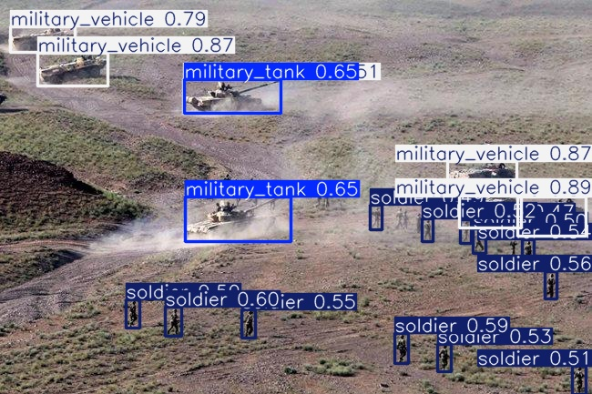

> [!IMPORTANT]
> **Legacy ML-Only Implementation:** This repository is being restructured as AMAD expands beyond the original machine-learning-only implementation toward a complete UAV perception and edge-deployment system.
>
> If you are using an older fork or want to access the previous ML-only repository structure and implementation, please refer to the [`legacy-ml-only-implementation`](../../tree/legacy-ml-only-implementation) branch.

Aerial Military Assets Detection (AMAD) is a UAV-based computer vision and edge-deployment project for detecting and classifying military assets from aerial imagery and video.

The project began as a machine-learning pipeline focused on dataset development, augmentation, balancing, and comparative evaluation of YOLO-based object detectors. It is now being extended into a complete airborne perception system in which trained detectors are deployed on resource-constrained UAV edge hardware for real-time inference.

The research focuses on the trade-off between **detection performance, small-object recognition, computational complexity, latency, and real-time deployability**. The objective is therefore not simply to train an accurate detector, but to establish a reproducible path from aerial data and dataset preparation through model training, optimization, edge deployment, and real-time UAV inference.

---

## Project Overview

UAV-based reconnaissance introduces a fundamentally different computer-vision environment from conventional ground-level detection. Objects observed from altitude occupy fewer pixels, viewing angles change rapidly, background clutter is significant, and motion blur, illumination changes, occlusion, and atmospheric conditions can substantially affect detection performance.

These constraints make model accuracy alone an insufficient criterion for selecting a detector. A model that performs well on a workstation may not provide the latency, throughput, memory footprint, or energy efficiency required for onboard UAV operation.

AMAD therefore treats the problem as an end-to-end pipeline connecting machine-learning development with UAV deployment:

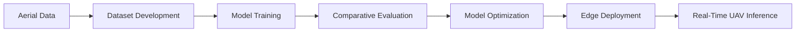

The research evaluates multiple generations and scales of YOLO detectors under controlled conditions while progressively incorporating the constraints imposed by UAV edge hardware.

The project currently contains the machine-learning research pipeline and is being expanded with the software and deployment components required to run the selected detector onboard a UAV.

---

## Research Objectives

The project investigates how modern object-detection architectures can be adapted for reliable aerial recognition of military assets while remaining practical for real-time edge deployment.

The primary research questions are:

1. How can deep-learning-based object detection reliably identify military assets from UAV imagery in real time?

2. How do YOLOv8, YOLOv11, and YOLO26 compare in terms of detection accuracy and computational efficiency for aerial imagery?

3. Which preprocessing, augmentation, dataset-cleaning, balancing, and downsampling strategies improve robustness to variations in aerial imagery?

4. How can small-object detection performance be improved when targets occupy only a small portion of an aerial frame?

5. Which detector provides an appropriate trade-off between detection quality and the computational constraints of UAV edge hardware?

The project therefore evaluates the complete path from dataset construction to airborne inference rather than treating model training as an isolated task.

---

## System Architecture

The overall system is divided into two closely connected layers: the **machine-learning development pipeline** and the **UAV edge-deployment pipeline**.

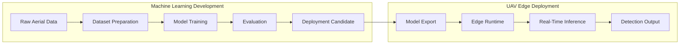

The machine-learning layer produces and evaluates candidate detectors. The deployment layer takes the selected model and integrates it into an onboard inference system capable of processing UAV imagery in real time.

---

## Machine Learning Pipeline

### Dataset Development

The dataset pipeline combines multiple sources of aerial and military-asset imagery into a unified detection dataset. The data contains multiple object categories representing military vehicles, personnel, and related classes.

Dataset preparation is treated as a first-class component of the project rather than as an informal preprocessing step.

The current pipeline includes annotation standardization, class remapping, corrupted-data handling, duplicate and redundant sample removal, class-distribution analysis, dataset balancing, augmentation, and controlled downsampling.

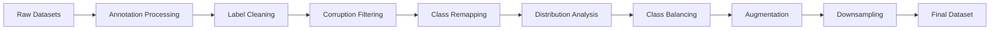

This process is designed to ensure that different model variants are trained and evaluated against the same prepared dataset, allowing their performance to be compared under consistent experimental conditions.

### Data Augmentation

The augmentation pipeline investigates transformations intended to reproduce common variations in aerial imagery.

These include HSV/color augmentation, Gaussian and motion blur, cutout, resizing, and controlled downsampling. The objective is to improve robustness to illumination changes, camera motion, occlusion, background clutter, and variations in object scale.

Small-object recognition is a particular focus because military assets viewed from UAV altitude may occupy only a small number of pixels within an image.

---

## Model Training

The original benchmark evaluates six primary YOLO configurations:

- YOLOv8n
- YOLOv8s
- YOLOv8m
- YOLOv11n
- YOLOv11s
- YOLOv11m

The broader research scope additionally includes the modern YOLO26 architecture for comparative evaluation. The proposal defines this comparison across both model generations and model scales so that accuracy and computational characteristics can be evaluated together.

The principal training configuration is:

| Parameter                  | Configuration                                                 |
| -------------------------- | ------------------------------------------------------------- |
| Optimizer                  | AdamW                                                         |
| Input Resolution           | 1024 × 1024                                                   |
| Epochs                     | 100                                                           |
| IoU Threshold              | 0.7                                                           |
| Small-Object Configuration | Augmented P2-style layer                                      |
| Evaluation                 | Precision, Recall, mAP50, mAP50-95, F1, Accuracy, GFLOPs, FPS |

The exact configuration of each experiment is retained with its corresponding experiment artifacts to maintain reproducibility.

---

## Model Configurations

The existing benchmark provides the following computational comparison:

| Variant  | Architecture               | GFLOPs | Deployment Suitability       |
| -------- | -------------------------- | -----: | ---------------------------- |
| YOLOv8n  | CSPDarknet (C2f + PAN-FPN) |    8.1 | Ultra-lightweight drones     |
| YOLOv8s  | Medium-scale encoder       |   28.4 | Jetson Nano / Xavier NX      |
| YOLOv8m  | Extended feature backbone  |   78.7 | High-performance edge        |
| YOLOv11n | Custom PAN + Backbone      |    6.3 | Low-power UAVs               |
| YOLOv11s | Intermediate architecture  |   21.3 | Balanced accuracy/efficiency |
| YOLOv11m | Deeper spatial encoder     |   67.7 | Edge GPU                     |

YOLO26 is part of the expanded research scope and will be evaluated under the same deployment-oriented methodology. Its inclusion is intended to extend the architectural comparison rather than assume its suitability for deployment in advance.

---

## Evaluation Summary

The current completed benchmark contains the following results:

| Model    | GFLOPs | Precision | Recall | mAP50 | mAP50-95 | F1 Score | Accuracy |
| -------- | -----: | --------: | -----: | ----: | -------: | -------: | -------: |
| YOLOv8n  |    8.1 |     0.758 |  0.717 | 0.768 |    0.569 |    0.737 |    0.690 |
| YOLOv8s  |   28.4 |     0.762 |  0.755 | 0.785 |    0.589 |    0.758 |    0.708 |
| YOLOv8m  |   78.7 |     0.810 |  0.771 | 0.827 |    0.633 |    0.790 |    0.752 |
| YOLOv11n |    6.3 |     0.790 |  0.743 | 0.805 |    0.600 |    0.766 |    0.726 |
| YOLOv11s |   21.3 |     0.787 |  0.764 | 0.805 |    0.606 |    0.775 |    0.731 |
| YOLOv11m |   67.7 |     0.816 |  0.792 | 0.832 |    0.640 |    0.803 |    0.758 |

These results establish the baseline against which subsequent deployment experiments will be compared.

The project does not treat these metrics as sufficient to determine the deployment model. The deployment stage introduces additional measurements such as inference latency, achievable FPS, memory requirements, computational complexity, and energy implications.

---

## From ML Model to UAV Edge System

The next stage of AMAD extends the existing trained models into an onboard perception system.

The deployment architecture is designed around a camera-to-detection pipeline:

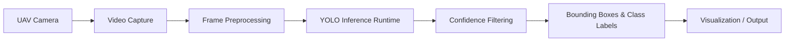

Onboard deployment introduces constraints that do not appear during conventional workstation-based inference.

The edge system must operate within the available compute, memory, power, thermal, and latency budgets of the UAV. Consequently, the deployment stage will evaluate the selected models under representative onboard conditions rather than relying solely on desktop GPU benchmarks.

The proposal specifically identifies Jetson-class and Coral-class systems as representative resource-constrained edge platforms for this analysis. Actual hardware-specific deployment configurations will be documented as the deployment implementation develops.

---

## Deployment Pipeline

The deployment layer bridges the trained model artifacts and the physical UAV platform.

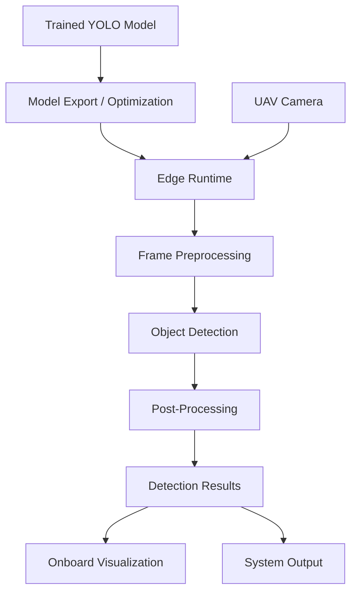

This architecture intentionally separates the trained model from the runtime. The same detector can therefore be evaluated through the research pipeline and subsequently integrated into the deployment runtime without duplicating the underlying model-development process.

---

## Real-Time Video Inference

The selected detector will ultimately operate on UAV video rather than isolated images.

The real-time inference pipeline processes frames sequentially, performs detection, filters low-confidence predictions, and overlays the resulting bounding boxes and class labels onto the video stream.

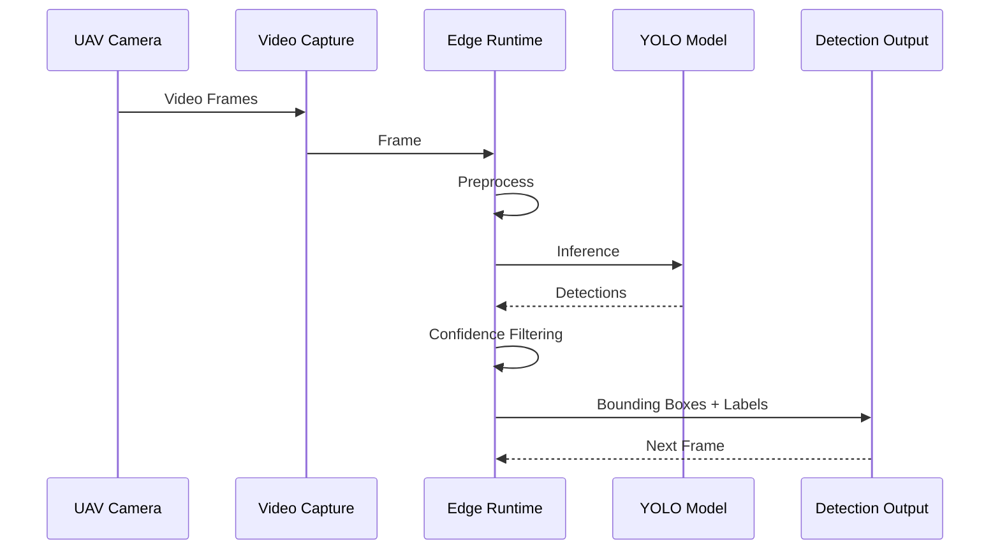

The existing ML inference implementation has demonstrated video detection at up to approximately 30 FPS in the development environment. Future deployment measurements will determine the actual throughput and latency achievable on the target UAV edge hardware.

---

## Deployment Evaluation

The deployment stage expands the evaluation criteria beyond conventional object-detection metrics.

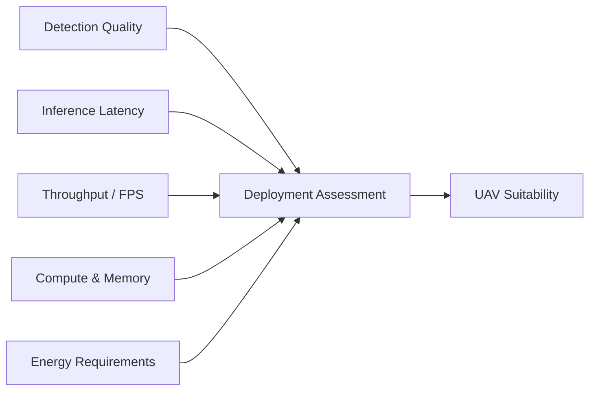

The following characteristics will be evaluated where applicable:

| Category                 | Measurements                                         |
| ------------------------ | ---------------------------------------------------- |
| Detection Performance    | Precision, Recall, mAP50, mAP50-95, F1               |
| Computational Complexity | GFLOPs, model size                                   |
| Runtime Performance      | Latency, FPS, throughput                             |
| Memory                   | Model/runtime memory requirements                    |
| Edge Compatibility       | Supported runtime and hardware constraints           |
| Energy                   | Power and energy implications of sustained inference |
| Small-Object Performance | Detection quality for small aerial targets           |
| Real-Time Operation      | End-to-end camera-to-output latency                  |

The purpose of this evaluation is to determine whether a model that performs well during offline benchmarking remains practical when deployed under the constraints of an airborne computing platform.

---

## End-to-End Research and Deployment Workflow

The complete project workflow connects the research pipeline with the deployment pipeline.

```mermaid
flowchart LR
    A["Aerial Data"] --> B["Dataset Engineering"] --> C["Model Training"] --> D["Benchmarking"] --> E["Model Selection"]

    E --> F["Model Optimization"] --> G["Edge Runtime"] --> H["UAV Camera"] --> I["Real-Time Inference"]

    I --> J["Hardware Benchmarking"] --> K["Deployment Validation"]
```

The resulting workflow allows model-development decisions to be validated against the conditions under which the final detector is expected to operate.

---

## Model Selection

The existing benchmark provides several deployment-oriented observations.

YOLOv11m achieved the highest recorded mAP50 and F1 score among the currently documented experiments, while YOLOv11n provides substantially lower computational complexity. YOLOv8s and YOLOv11s occupy intermediate points in the accuracy-compute space.

These results should be interpreted as **offline model-selection evidence rather than final deployment results**.

The final deployment candidate will be determined using both the existing detection metrics and measurements obtained on the target edge platform.

The intended selection process is:

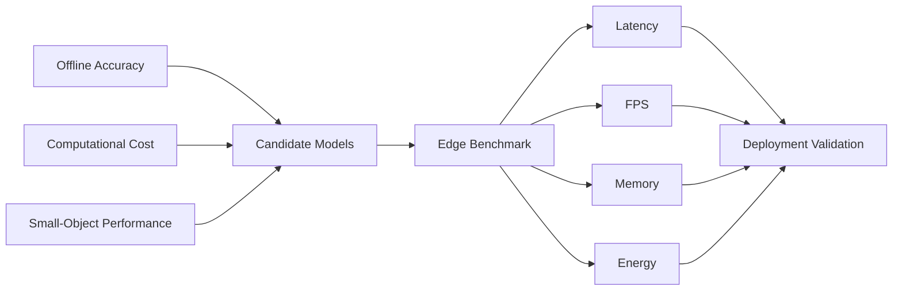

This prevents the final model from being selected solely according to a single offline metric.

---

## Core ML Utilities

The existing codebase contains utilities for the major dataset and inference stages.

| Component                        | Purpose                                            |
| -------------------------------- | -------------------------------------------------- |
| `annotation_visualization.py`    | Visualize dataset annotations and bounding boxes   |
| `class_distribution_analysis.py` | Analyze and visualize class distributions          |
| `augmentation.py`                | Apply dataset augmentation                         |
| `downsampling.py`                | Perform dataset downsampling                       |
| `normalized_downsampling.py`     | Perform normalized dataset downsampling            |
| `unique_images_count.py`         | Analyze unique image counts                        |
| `detection.py`                   | Run video inference using trained YOLO models      |
| `confident_detection.py`         | Perform confidence-filtered detection              |
| `corruption-handling/`           | Identify and handle corrupted or inconsistent data |
| `dataset-balancing/`             | Remap, filter, split, and balance the dataset      |

The deployment layer will introduce a separate set of runtime-oriented components rather than coupling hardware-specific code directly to the research and training pipeline.

---

## Known Limitations

The current detection system has known limitations associated with the aerial operating environment.

Performance can degrade under heavy occlusion, background clutter, low-light conditions, and aerial viewpoints where target objects occupy very few pixels. Dataset diversity also remains an important factor in generalization across different environments, viewing angles, weather conditions, and target appearances.

The current benchmark primarily represents the machine-learning evaluation stage. Real-world UAV deployment introduces additional variables such as camera characteristics, onboard compute limitations, thermal constraints, power consumption, and end-to-end system latency.

These factors are therefore treated as part of the subsequent deployment validation stage rather than being inferred solely from desktop training results.

---

## Future Development

The project is being extended in several directions.

The primary development path is the integration of the trained detector with UAV edge hardware and a real-time video-processing runtime. This includes model export and optimization, camera integration, frame preprocessing, inference execution, post-processing, runtime monitoring, and measurement of end-to-end latency and throughput.

Further research directions include thermal and night-vision imagery, object tracking, model quantization and pruning, improved small-object detection, and broader field validation under realistic aerial conditions.

The intended progression is:

```mermaid
flowchart LR
    A["Completed ML Benchmark"] --> B["Expanded YOLO Evaluation"] --> C["Deployment Candidate"] --> D["Model Optimization"]

    D --> E["Edge Runtime"] --> F["UAV Camera Integration"] --> G["Real-Time Flight Inference"] --> H["Hardware Benchmarking"] --> I["Field Validation"]
```

---

## Research Reproducibility

Reproducibility is a core requirement of the project.

Dataset preparation scripts, training notebooks, model configurations, experiment results, and evaluation artifacts are version-controlled. A consistent dataset split and evaluation methodology are maintained across model experiments wherever practical.

The experiment directories are structured to retain the context required to reproduce individual training runs, while the broader repository structure separates research artifacts from the deployment implementation.

This allows the project to evolve from a research-oriented ML repository into a deployable UAV perception system without losing the experimental history on which the deployment decisions are based.

---

## Conclusion

Aerial Military Assets Detection (AMAD) is evolving from a machine-learning benchmark into an end-to-end UAV perception and edge-deployment system.

The existing work establishes a structured dataset-development pipeline and comparative evaluation of YOLO-based detectors for aerial military-asset recognition. The next stage connects these models to resource-constrained onboard computing, with deployment decisions based not only on detection accuracy but also on latency, throughput, computational complexity, memory, and energy requirements.

The resulting system is intended to provide a reproducible path from aerial data and model development to real-time onboard inference:

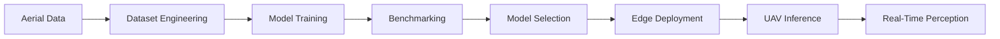

The repository therefore serves both as a record of the underlying research and as the foundation for the software required to operate the resulting perception system on a UAV platform.
